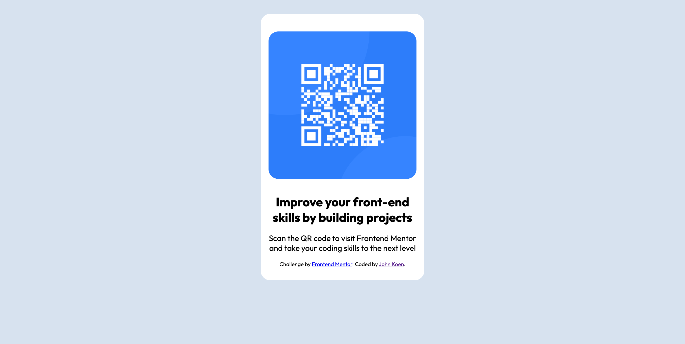

# Frontend Mentor - QR code component solution

This is a solution to the [QR code component challenge on Frontend Mentor](https://www.frontendmentor.io/challenges/qr-code-component-iux_sIO_H). Frontend Mentor challenges help you improve your coding skills by building realistic projects.

## Table of contents

- [Overview](#overview)
  - [Screenshot](#screenshot)
  - [Links](#links)
- [My process](#my-process)
  - [Built with](#built-with)
  - [What I learned](#what-i-learned)
  - [Useful resources](#useful-resources)
- [Author](#author)

## Overview

This was my first challenge on Frontend Mentor. Also my first attempt at writing something from scratch in HTML & CSS

### Screenshot

### Links

- Solution URL: [https://github.com/jlkoen/fem-01-qr-code-component](https://github.com/jlkoen/fem-01-qr-code-component)
- Live Site URL: [https://jlkoen.github.io/fem-01-qr-code-component/](https://jlkoen.github.io/fem-01-qr-code-component/)

## My process

I studied W3 Schools HTML & CSS courses. I also looked at a couple of other students solutions to see how they approached different aspects of the challenge.

### Built with

- Semantic HTML5 markup
- CSS custom properties
- Flexbox
- Mobile-first workflow

### What I learned

This was a great hands on example of how to create a simple HTML page from scratch. Previously I edited other pages but never created one from the beginning.

### Useful resources

- [W3 Schools HTML course](https://www.w3schools.com/html/default.asp) - This gave me a full understanding of HTML and the parts I was not aware of.
- [W3 Schools CSS course](https://www.w3schools.com/css/default.asp) - This was my first CSS course. I loved the "Try it yourself" sections that allow you to edit the CSS and see the results.

## Author

- Frontend Mentor - [@jlkoen](https://www.frontendmentor.io/profile/jlkoen)
